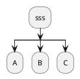
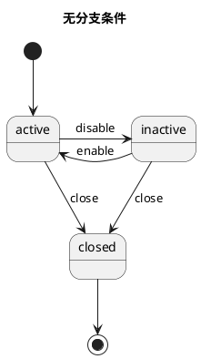
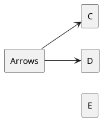
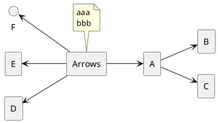
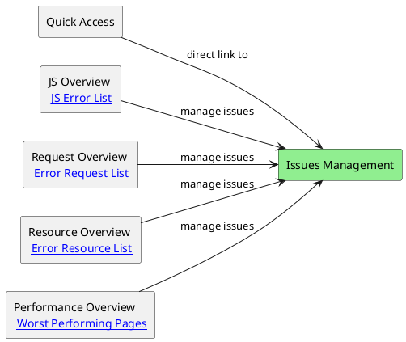
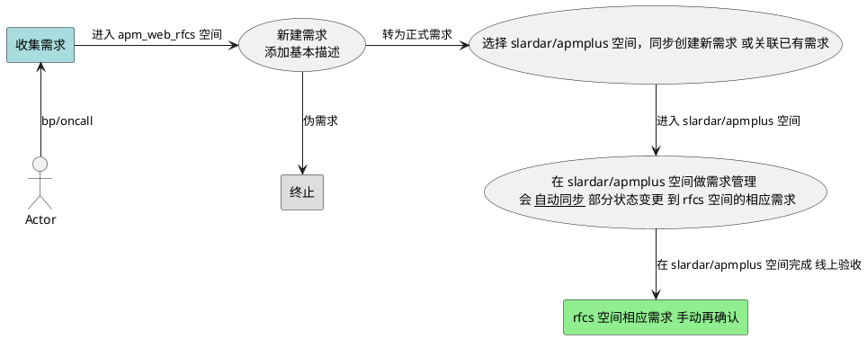
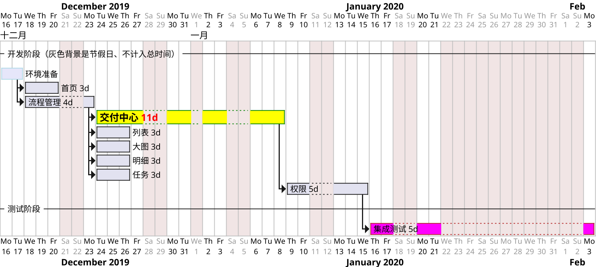

# plantuml

```plantuml
@startuml
:sss;
split
   :A;
   kill
split again
   :B;
   detach
split again
   :C;
   kill
end split
@enduml
```

```plantuml
@startuml
title 无分支条件

[*] --> active
active -right-> inactive : disable
inactive -left-> active  : enable
inactive --> closed  : close
active --> closed  : close
closed --> [*]
@enduml
```

```plantuml
@startuml

left to right direction
'top to bottom direction

rectangle Arrows
rectangle C
rectangle D
rectangle E

Arrows --> C
Arrows --> D
Arrows --[hidden]> E

@enduml
```

```plantuml
@startuml
left to right direction
'top to bottom direction

rectangle Arrows
note top : aaa\nbbb
rectangle A
rectangle B
rectangle C
rectangle D
rectangle E

Arrows --> A
A --> B
A --> C
Arrows -u-> D
Arrows -u-> E
Arrows -u-> F

@enduml
```

```plantuml
@startuml
left to right direction

rectangle ima as "Issues Management" #lightgreen
rectangle qac as "Quick Access"
rectangle jse as "JS Overview \n [[https://baidu.com JS Error List]]"
rectangle req as "Request Overview \n [[https://baidu.com Error Request List]]"
rectangle res as "Resource Overview \n [[https://baidu.com Error Resource List]]"
rectangle per as "Performance Overview \n [[https://baidu.com Worst Performing Pages]]"

qac --> ima : direct link to
jse --> ima : manage issues
req --> ima : manage issues
res --> ima : manage issues
per --> ima : manage issues

@enduml
```

```plantuml
@startuml

!$rfcs = "进入 apm_web_rfcs 空间"
!$coll = "收集需求"
!$new  = "新建需求\n添加基本描述"
!$rc   = "选择 slardar/apmplus 空间，同步创建新需求 或关联已有需求"
!$entr = "进入 slardar/apmplus 空间"
!$main = '在 slardar/apmplus 空间做需求管理 \n 会 <u>自动同步</u> 部分状态变更 到 rfcs 空间的相应需求'
!$fm   = "在 slardar/apmplus 空间完成 线上验收"
!$fr   = "rfcs 空间相应需求 手动再确认"
!$stop = "终止"

rectangle $coll #A9DCDF
rectangle frr as "$fr" #lightgreen
rectangle $stop #ddd

:Actor: -u-> $coll : bp/oncall
$coll -r-> ($new) : $rfcs
($new) -r-> ($rc) : 转为正式需求
($new) -d-> ($stop) : 伪需求
($rc) -d-> ($main) : $entr
($main) -d-> frr : $fm

@enduml
```

```plantuml
' a 不能变成 :a:
a -> b
if "a" then
  -->[true] "Some Action"
else
  ->[false] "Something else"
endif
```

```plantuml
'甘特图

@startgantt
/'
单行注释、放在 单引号之间，多行注释前后加斜杠
[正式上线] lasts 1 day and starts at 2020/03/20
'/
'skinparam classFontSize 10'

scale 2
project starts the 2019/12/16
saturday are closed
sunday are closed
2020/01/01 is closed
2020/01/22 to 2020/02/02 is closed
2019/12/16 to 2019/12/30 are named [十二月]
2020/01/01 to 2020/01/31 are named [一月]
'2020/02/01 to 2020/02/30 are named [二月]'

-- 开发阶段（灰色背景是节假日、不计入总时间） --
[环境准备] as [hj] lasts 2 days and is colored in Lavender/LightBlue
then [首页 3d] lasts 3 days
[流程管理 4d] as [lc] lasts 4 days
[hj] -> [lc]

[<size:13><b>交付中心 <color:red>11d] as [jf] lasts 11 days
[jf] starts at [lc]'s end and is colored in Yellow/Green
[列表 3d] lasts 3 days and starts at [jf]'s start
[大图 3d] lasts 3 days and starts at [jf]'s start
[明细 3d] lasts 3 days and starts at [jf]'s start
[大图 3d] lasts 3 days and starts at [jf]'s start
[任务 3d] lasts 3 days and starts at [jf]'s start
[权限 5d] as [qx] lasts 5 days and starts at [jf]'s end

-- 测试阶段 --
[集成测试 5d] as [jc] lasts 5 days and is colored in Fuchsia/FireBrick
[qx] -> [jc]

@endgantt

```
